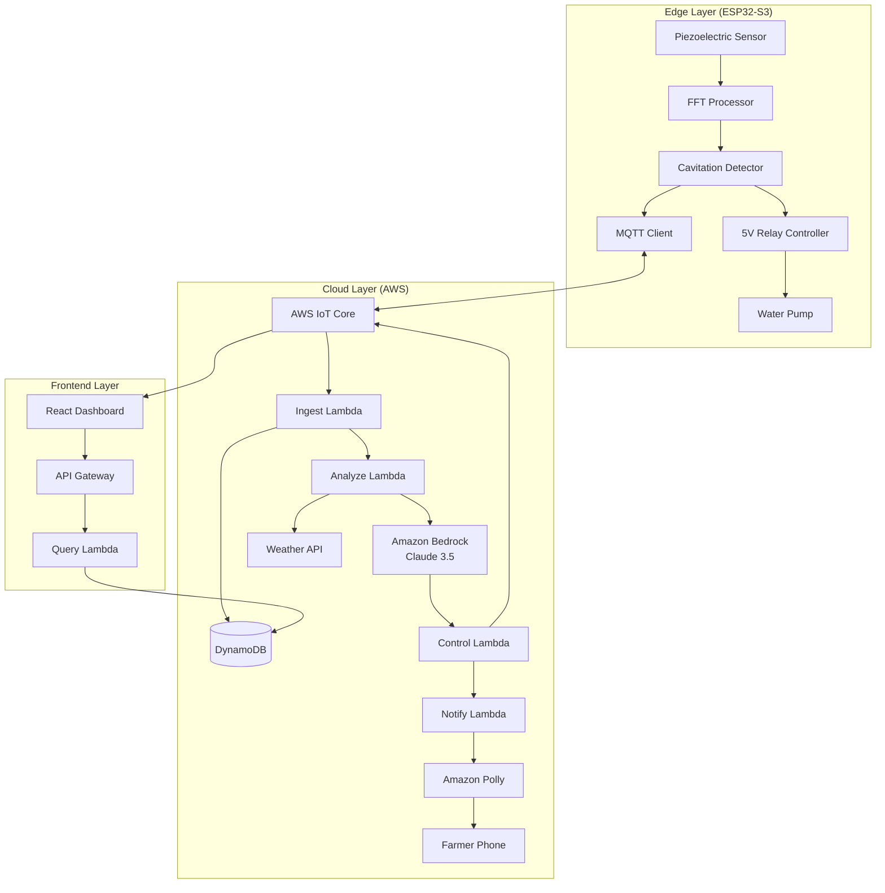

# Design Document: Acoustic Pump Monitor

## Overview

The Acoustic Pump Monitor is a three-tier edge-AI system that prevents groundwater over-extraction through non-invasive acoustic monitoring. The system architecture consists of:

1. **Edge Layer**: ESP32-S3-based devices with piezoelectric sensors performing real-time FFT analysis and autonomous pump control
2. **Cloud Layer**: AWS serverless infrastructure (IoT Core, Lambda, DynamoDB, Bedrock, Polly) for AI-driven decision making and data persistence
3. **Frontend Layer**: React-based admin dashboard for community-level water management

The system operates in a closed-loop control architecture: sensors detect cavitation → cloud AI analyzes patterns → autonomous actions are taken → farmers are notified via voice calls.

## Architecture

### System Diagram



### Data Flow

1. **Monitoring Flow**: Piezo sensor → FFT analysis → Cavitation detection → Local relay control + MQTT telemetry
2. **AI Analysis Flow**: MQTT telemetry → IoT Core → Ingest Lambda → DynamoDB → Analyze Lambda → Bedrock AI → Control command
3. **Notification Flow**: Control Lambda → Notify Lambda → Polly TTS → Voice call to farmer
4. **Dashboard Flow**: Admin request → API Gateway → Query Lambda → DynamoDB → Real-time updates via WebSocket

## Components and Interfaces

### Edge Components

#### 1. Piezoelectric Sensor Interface

**Hardware**: Piezoelectric disc sensor (₹50) connected to ESP32-S3 ADC pin

**Specifications**:
- Sampling rate: 1 kHz minimum (configurable up to 10 kHz)
- ADC resolution: 12-bit (ESP32-S3 native)
- Voltage range: 0-3.3V (with voltage divider if needed)
- Mounting: Adhesive or clip mount to pump casing

**Interface**:
```cpp
class PiezoSensor {
public:
    void initialize(uint8_t adc_pin);
    int16_t readSample();  // Returns raw ADC value
    void startContinuousSampling(uint32_t sample_rate_hz);
    void stopSampling();
    bool getBuffer(int16_t* buffer, size_t length);  // Get buffered samples
};
```

#### 2. FFT Processor

**Algorithm**: Fast Fourier Transform using ESP-DSP library (optimized for ESP32-S3)

**Specifications**:
- FFT size: 2048 points (2 seconds at 1 kHz sampling)
- Window function: Hann window to reduce spectral leakage
- Frequency resolution: ~0.5 Hz
- Processing time: <500ms per FFT on ESP32-S3

**Interface**:
```cpp
class FFTProcessor {
public:
    void initialize(size_t fft_size);
    void computeFFT(int16_t* time_domain, float* frequency_domain);
    void findPeaks(float* frequency_domain, FrequencyPeak* peaks, size_t max_peaks);
    float getEnergyInBand(float* frequency_domain, float low_hz, float high_hz);
};

struct FrequencyPeak {
    float frequency_hz;
    float magnitude;
};
```

#### 3. Cavitation Detector

**Algorithm**: Rule-based detection using frequency signature analysis

**Detection Logic**:
- Cavitation signature: Elevated energy in 2-10 kHz band
- Threshold: Energy ratio (cavitation band / baseline) > 2.5
- Confirmation: 3 consecutive detections to avoid false positives

**Interface**:
```cpp
enum PumpState {
    PUMP_OFF,
    PUMP_NORMAL,
    PUMP_CAVITATING
};

class CavitationDetector {
public:
    void initialize(float threshold_ratio);
    PumpState detectState(float* frequency_domain);
    void updateBaseline(float* frequency_domain);  // Learn normal operation
    float getConfidence();  // Returns detection confidence 0-1
};
```

#### 4. MQTT Client

**Protocol**: MQTT 3.1.1 over TLS (AWS IoT Core)

**Topics**:
- Publish: `jal-dhwani/{device_id}/telemetry` (pump data)
- Publish: `jal-dhwani/{device_id}/status` (device health)
- Subscribe: `jal-dhwani/{device_id}/control` (pump commands)

**Message Format** (JSON):
```json
{
  "device_id": "ESP32_ABC123",
  "timestamp": 1704067200,
  "pump_state": "cavitating",
  "fft_peaks": [
    {"frequency_hz": 3500, "magnitude": 0.85},
    {"frequency_hz": 7200, "magnitude": 0.62}
  ],
  "cavitation_confidence": 0.92,
  "relay_state": "open"
}
```

**Interface**:
```cpp
class MQTTClient {
public:
    void connect(const char* endpoint, const char* device_id, const char* cert);
    void publish(const char* topic, const char* payload);
    void subscribe(const char* topic, MessageCallback callback);
    void loop();  // Process incoming messages
    bool isConnected();
};

typedef void (*MessageCallback)(const char* topic, const char* payload);
```

#### 5. Relay Controller

**Hardware**: 5V relay module (₹200) controlling pump power line

**Specifications**:
- Control: GPIO pin (active high/low configurable)
- Load capacity: 10A @ 240V AC (supports up to 5 HP pumps)
- Response time: <100ms

**Interface**:
```cpp
enum RelayState {
    RELAY_OPEN,   // Pump off
    RELAY_CLOSED  // Pump on
};

class RelayController {
public:
    void initialize(uint8_t gpio_pin, bool active_high);
    void setState(RelayState state);
    RelayState getState();
    void emergencyStop();  // Immediate pump shutdown
};
```

### Cloud Components

#### 6. Ingest Lambda Function

**Runtime**: Python 3.11

**Trigger**: AWS IoT Core rule forwarding MQTT messages

**Responsibilities**:
- Validate telemetry schema
- Store telemetry in DynamoDB
- Trigger downstream analysis

**Interface**:
```python
def lambda_handler(event, context):
    """
    Input: IoT Core event with MQTT message
    Output: DynamoDB write confirmation
    """
    telemetry = validate_telemetry(event)
    store_telemetry(telemetry)
    trigger_analysis(telemetry)
    return {"statusCode": 200}

def validate_telemetry(event: dict) -> dict:
    """Validate required fields and data types"""
    pass

def store_telemetry(telemetry: dict):
    """Write to DynamoDB with device_id and timestamp as keys"""
    pass
```

**DynamoDB Schema**:
```
Table: jal-dhwani-telemetry
Partition Key: device_id (String)
Sort Key: timestamp (Number)
Attributes:
  - pump_state (String)
  - fft_peaks (List)
  - cavitation_confidence (Number)
  - relay_state (String)
TTL: 2 years
```

#### 7. Analyze Lambda Function

**Runtime**: Python 3.11

**Trigger**: EventBridge rule (every 5 minutes) or immediate on cavitation event

**Responsibilities**:
- Query recent telemetry for device
- Fetch weather forecast
- Call Bedrock AI for irrigation recommendation
- Generate control commands

**Interface**:
```python
def lambda_handler(event, context):
    """
    Input: Device ID and trigger type
    Output: Control command and reasoning
    """
    device_id = event["device_id"]
    telemetry_history = get_recent_telemetry(device_id, hours=24)
    weather = get_weather_forecast(device_id)
    recommendation = call_bedrock_ai(telemetry_history, weather)
    publish_control_command(device_id, recommendation)
    return recommendation

def call_bedrock_ai(telemetry: list, weather: dict) -> dict:
    """
    Call Amazon Bedrock with Claude 3.5 Sonnet
    Returns: {
        "action": "stop|start|delay",
        "duration_minutes": 60,
        "reasoning": "Natural language explanation"
    }
    """
    pass
```

**Bedrock Prompt Template**:
```
You are an irrigation advisor for a farmer in rural India. Analyze the following data and recommend whether the pump should run:

Pump Health (last 24 hours):
- Cavitation events: {cavitation_count}
- Total runtime: {runtime_hours} hours
- Current state: {current_state}

Weather Forecast (next 7 days):
- Rainfall probability: {rain_probability}%
- Temperature: {temperature}°C

Crop Stage: {crop_stage} (if available)

Provide a recommendation in JSON format:
{
  "action": "stop|start|delay",
  "duration_minutes": <number>,
  "reasoning": "<explanation in simple Hindi/English>"
}
```

#### 8. Control Lambda Function

**Runtime**: Python 3.11

**Trigger**: Invoked by Analyze Lambda

**Responsibilities**:
- Publish control commands to IoT Core
- Trigger voice notifications
- Log control actions

**Interface**:
```python
def lambda_handler(event, context):
    """
    Input: Control recommendation from Analyze Lambda
    Output: MQTT command published
    """
    device_id = event["device_id"]
    action = event["action"]
    reasoning = event["reasoning"]
    
    publish_mqtt_command(device_id, action)
    trigger_voice_notification(device_id, reasoning)
    log_control_action(device_id, action, reasoning)
    
    return {"statusCode": 200}
```

**MQTT Control Message Format**:
```json
{
  "command": "stop",
  "duration_minutes": 60,
  "reason_code": "cavitation_detected",
  "timestamp": 1704067200
}
```

#### 9. Notify Lambda Function

**Runtime**: Python 3.11

**Trigger**: Invoked by Control Lambda

**Responsibilities**:
- Generate voice message using Polly
- Initiate phone call to farmer
- Log notification delivery

**Interface**:
```python
def lambda_handler(event, context):
    """
    Input: Device ID and reasoning text
    Output: Voice call initiated
    """
    device_id = event["device_id"]
    reasoning = event["reasoning"]
    language = get_farmer_language(device_id)
    
    audio_url = generate_voice_message(reasoning, language)
    phone_number = get_farmer_phone(device_id)
    initiate_call(phone_number, audio_url)
    
    return {"statusCode": 200}

def generate_voice_message(text: str, language: str) -> str:
    """
    Use Amazon Polly to synthesize speech
    Supported languages: hi-IN (Hindi), ta-IN (Tamil), te-IN (Telugu)
    Returns: S3 URL of audio file
    """
    pass
```

#### 10. Query Lambda Function

**Runtime**: Python 3.11

**Trigger**: API Gateway (REST API for dashboard)

**Responsibilities**:
- Query telemetry by device, time range, or village
- Aggregate statistics for heatmaps
- Return real-time device status

**Interface**:
```python
def lambda_handler(event, context):
    """
    Input: API Gateway request with query parameters
    Output: JSON response with telemetry data
    """
    query_type = event["queryStringParameters"]["type"]
    
    if query_type == "device_status":
        return get_device_status(event["queryStringParameters"]["device_id"])
    elif query_type == "village_heatmap":
        return get_village_heatmap(event["queryStringParameters"]["village_id"])
    elif query_type == "telemetry_history":
        return get_telemetry_history(event["queryStringParameters"])
```

### Frontend Components

#### 11. React Dashboard

**Framework**: React 18 with Tailwind CSS

**Components**:

**PumpMap Component**:
```jsx
// Displays village-wide pump locations with color-coded status
function PumpMap({ pumps }) {
  return (
    <div className="w-full h-96">
      <MapContainer center={[lat, lng]} zoom={13}>
        {pumps.map(pump => (
          <Marker
            key={pump.device_id}
            position={[pump.lat, pump.lng]}
            icon={getStatusIcon(pump.cavitation_frequency)}
          >
            <Popup>
              <PumpCard pump={pump} />
            </Popup>
          </Marker>
        ))}
      </MapContainer>
    </div>
  );
}
```

**PumpCard Component**:
```jsx
// Displays detailed pump status
function PumpCard({ pump }) {
  return (
    <div className="bg-white rounded-lg shadow p-4">
      <h3 className="font-bold">{pump.device_id}</h3>
      <div className="mt-2">
        <StatusBadge state={pump.pump_state} />
        <p>Runtime: {pump.runtime_hours}h</p>
        <p>Cavitation events: {pump.cavitation_count}</p>
        <p>Last seen: {formatTimestamp(pump.last_seen)}</p>
      </div>
      <button onClick={() => viewDetails(pump.device_id)}>
        View Details
      </button>
    </div>
  );
}
```

**API Service**:
```javascript
// API client for backend communication
class DashboardAPI {
  async getVillagePumps(villageId) {
    const response = await fetch(
      `${API_ENDPOINT}/pumps?village_id=${villageId}`
    );
    return response.json();
  }
  
  async getPumpTelemetry(deviceId, startTime, endTime) {
    const response = await fetch(
      `${API_ENDPOINT}/telemetry?device_id=${deviceId}&start=${startTime}&end=${endTime}`
    );
    return response.json();
  }
  
  subscribeToUpdates(deviceId, callback) {
    // WebSocket connection for real-time updates
    const ws = new WebSocket(`${WS_ENDPOINT}?device_id=${deviceId}`);
    ws.onmessage = (event) => callback(JSON.parse(event.data));
    return ws;
  }
}
```

## Data Models

### Edge Data Models

**Telemetry Message**:
```cpp
struct TelemetryMessage {
    char device_id[32];
    uint32_t timestamp;
    PumpState pump_state;
    FrequencyPeak fft_peaks[10];
    uint8_t peak_count;
    float cavitation_confidence;
    RelayState relay_state;
    float battery_voltage;  // Optional
    int8_t wifi_rssi;
};
```

**Device Configuration**:
```cpp
struct DeviceConfig {
    char wifi_ssid[64];
    char wifi_password[64];
    char mqtt_endpoint[128];
    char device_id[32];
    char farmer_phone[16];
    float latitude;
    float longitude;
    char language[8];  // "hi", "ta", "te", "mr"
};
```

### Cloud Data Models

**DynamoDB Telemetry Record**:
```json
{
  "device_id": "ESP32_ABC123",
  "timestamp": 1704067200,
  "pump_state": "cavitating",
  "fft_peaks": [
    {"frequency_hz": 3500, "magnitude": 0.85}
  ],
  "cavitation_confidence": 0.92,
  "relay_state": "open",
  "battery_voltage": 3.7,
  "wifi_rssi": -65,
  "ttl": 1767139200
}
```

**Control Command**:
```json
{
  "device_id": "ESP32_ABC123",
  "command": "stop",
  "duration_minutes": 60,
  "reason_code": "cavitation_detected",
  "timestamp": 1704067200,
  "ai_reasoning": "पंप में कैविटेशन का पता चला है। मोटर को नुकसान से बचाने के लिए 1 घंटे के लिए बंद किया जा रहा है।"
}
```

**Weather Data**:
```json
{
  "location": {"lat": 28.6139, "lng": 77.2090},
  "forecast": [
    {
      "date": "2024-01-01",
      "temp_max": 25,
      "temp_min": 15,
      "rain_probability": 20,
      "rainfall_mm": 0
    }
  ],
  "cached_at": 1704067200
}
```

## Correctness Properties

*A property is a characteristic or behavior that should hold true across all valid executions of a system—essentially, a formal statement about what the system should do. Properties serve as the bridge between human-readable specifications and machine-verifiable correctness guarantees.*


### Property Reflection

After analyzing all acceptance criteria, I've identified the following redundancies and consolidations:

**Redundancies Identified**:
1. Properties 3.1 and 3.2 (telemetry publishing on events) can be consolidated into a single property about event-driven telemetry
2. Properties 6.3 and 6.4 (relay control for stop/start) can be combined into one property about command-to-relay mapping
3. Properties 9.1 and 9.2 (offline cavitation detection and shutdown) are logically connected and can be combined
4. Properties 3.5, 12.3, and 15.2 (message completeness) follow the same pattern and can use a unified approach
5. Properties 2.1 and FFT execution is implied by 2.2 (cavitation classification requires FFT), so 2.1 is redundant

**Consolidations**:
- Combine timing properties (2.3, 3.1, 6.2) into a general "response time bounds" property
- Combine message completeness properties into a single "telemetry schema compliance" property
- Combine offline operation properties (2.5, 9.1, 9.2) into "offline safety guarantees"

### Correctness Properties

**Property 1: Sampling Rate Guarantee**
*For any* pump running state and any time window, the vibration sampling rate should be at least 1 kHz (one sample per millisecond).
**Validates: Requirements 1.2**

**Property 2: Buffer Capacity Invariant**
*For any* system state, the vibration data buffer should have capacity for at least 2 seconds of samples at the configured sampling rate.
**Validates: Requirements 1.4**

**Property 3: Cavitation Classification Correctness**
*For any* FFT frequency spectrum with elevated energy (>2.5x baseline) in the 2-10 kHz band, the system should classify the pump state as "cavitating".
**Validates: Requirements 2.2**

**Property 4: Emergency Shutdown Timing**
*For any* cavitation detection event, the relay should open (pump shutdown) within 2 seconds of detection.
**Validates: Requirements 2.3**

**Property 5: Offline Safety Guarantee**
*For any* system state where internet connectivity is unavailable, cavitation detection and emergency shutdown should continue to function using local FFT analysis.
**Validates: Requirements 2.5, 9.1, 9.2**

**Property 6: Event-Driven Telemetry Publishing**
*For any* pump state change (off→on, on→cavitating, cavitating→off), an MQTT telemetry message should be published within 5 seconds.
**Validates: Requirements 3.1, 3.2**

**Property 7: Periodic Health Telemetry**
*For any* 15-minute time window while connected to Wi-Fi, at least one health telemetry message should be published.
**Validates: Requirements 3.3, 15.1**

**Property 8: MQTT Retry on Failure**
*For any* MQTT connection failure, telemetry should be buffered locally and transmission retried every 30 seconds until success.
**Validates: Requirements 3.4**

**Property 9: Telemetry Schema Compliance**
*For any* telemetry message published by the edge device, it should contain device_id, timestamp, pump_state, fft_peaks, cavitation_confidence, and relay_state fields.
**Validates: Requirements 3.5, 12.3, 15.2**

**Property 10: Schema Validation Enforcement**
*For any* incoming telemetry message at the cloud ingestion layer, schema validation should be performed before storage.
**Validates: Requirements 4.1**

**Property 11: Telemetry Storage Round-Trip**
*For any* valid telemetry message stored in DynamoDB, querying by device_id and timestamp should retrieve an equivalent message.
**Validates: Requirements 4.2**

**Property 12: Invalid Message Rejection**
*For any* malformed telemetry message (missing required fields or invalid data types), the ingestion service should reject it and log an error without storing.
**Validates: Requirements 4.3**

**Property 13: Analysis Trigger on Storage**
*For any* telemetry message successfully stored in DynamoDB, the analysis Lambda function should be triggered.
**Validates: Requirements 4.5**

**Property 14: AI Input Completeness**
*For any* irrigation recommendation request, the AI engine should query both pump telemetry history and weather forecast data before generating recommendations.
**Validates: Requirements 5.2**

**Property 15: AI Output Structure**
*For any* AI-generated irrigation recommendation, the output should contain action (start/stop/delay), duration_minutes, and reasoning fields.
**Validates: Requirements 5.3, 5.4**

**Property 16: Control Command Propagation**
*For any* AI-generated pump control command, an MQTT message should be published to the device's control topic.
**Validates: Requirements 6.1**

**Property 17: Command Execution Timing**
*For any* pump control command received by the edge device, the relay should execute the command within 2 seconds.
**Validates: Requirements 6.2**

**Property 18: Command-to-Relay Mapping**
*For any* pump control command, "stop" should open the relay and "start" should close the relay.
**Validates: Requirements 6.3, 6.4**

**Property 19: Command Acknowledgment**
*For any* executed pump control command, a confirmation message should be published to MQTT.
**Validates: Requirements 6.5**

**Property 20: Voice Notification Generation**
*For any* automatic pump stop event, a voice message should be generated in the farmer's configured language.
**Validates: Requirements 7.1**

**Property 21: Voice Message Content Inclusion**
*For any* generated voice message, it should contain the AI engine's natural language reasoning.
**Validates: Requirements 7.2**

**Property 22: Multi-Language Support**
*For any* language code in {hi, ta, te, mr}, the voice notifier should successfully generate speech using Amazon Polly.
**Validates: Requirements 7.3**

**Property 23: Call Initiation on Voice Generation**
*For any* successfully generated voice message, a phone call should be initiated to the farmer's registered number.
**Validates: Requirements 7.4**

**Property 24: Pump Color Coding Logic**
*For any* pump with cavitation frequency F, the dashboard should assign color: green if F < 2/day, yellow if 2 ≤ F < 5/day, red if F ≥ 5/day.
**Validates: Requirements 8.2**

**Property 25: Pump Detail Completeness**
*For any* pump selected in the dashboard, the detail view should display cavitation_events, runtime_hours, and ai_recommendations.
**Validates: Requirements 8.3**

**Property 26: Real-Time Dashboard Updates**
*For any* new telemetry message received via WebSocket, the dashboard should update the corresponding pump's status within 1 second.
**Validates: Requirements 8.4**

**Property 27: Water-Stressed Zone Detection**
*For any* geographic area where ≥3 pumps have cavitation frequency ≥ 5/day, the dashboard should highlight it as a water-stressed zone.
**Validates: Requirements 8.5**

**Property 28: Connectivity Restoration Sync**
*For any* transition from offline to online state, all buffered telemetry should be uploaded to the cloud.
**Validates: Requirements 9.3**

**Property 29: Offline Buffer Capacity**
*For any* offline period, the edge device should store at least 24 hours of telemetry (assuming 5-minute intervals = 288 messages).
**Validates: Requirements 9.4**

**Property 30: Circular Buffer Overflow**
*For any* full local storage buffer, writing a new telemetry message should overwrite the oldest message (FIFO behavior).
**Validates: Requirements 9.5**

**Property 31: Query Parameter Support**
*For any* telemetry query with device_id, start_time, end_time, and pump_state filters, the service should return matching records.
**Validates: Requirements 12.2**

**Property 32: Data Archival Trigger**
*For any* telemetry record with timestamp older than 2 years, the archival service should move it to S3 storage.
**Validates: Requirements 12.4**

**Property 33: CSV Export Round-Trip**
*For any* set of telemetry records, exporting to CSV and parsing back should preserve all field values.
**Validates: Requirements 12.5**

**Property 34: Weather API Invocation**
*For any* irrigation recommendation request, the AI engine should call the weather API with the pump's geographic coordinates.
**Validates: Requirements 13.1**

**Property 35: Weather Data Completeness**
*For any* weather API response, it should contain at least 7 days of forecasts with rainfall_probability and temperature fields.
**Validates: Requirements 13.2**

**Property 36: Weather API Fallback**
*For any* weather API failure (timeout or error), the AI engine should generate recommendations using only pump health data.
**Validates: Requirements 13.3**

**Property 37: Weather Cache Reuse**
*For any* weather data cached less than 6 hours ago, subsequent requests for the same location should return cached data without API calls.
**Validates: Requirements 13.4**

**Property 38: Provisioning Mode AP Broadcast**
*For any* system state in provisioning mode, a Wi-Fi access point should be broadcasting for configuration.
**Validates: Requirements 14.2**

**Property 39: Configuration Application**
*For any* saved device configuration, the device should attempt to connect to the configured Wi-Fi network and MQTT broker.
**Validates: Requirements 14.4**

**Property 40: Configuration Persistence Round-Trip**
*For any* device configuration saved to non-volatile memory, rebooting the device and reading configuration should return equivalent values.
**Validates: Requirements 14.5**

**Property 41: Health Metric Completeness**
*For any* health telemetry message, it should contain battery_voltage (if applicable), wifi_rssi, uptime, and firmware_version fields.
**Validates: Requirements 15.2**

**Property 42: Low Health Warning Display**
*For any* health metrics with battery_voltage < 3.3V or wifi_rssi < -80 dBm, the dashboard should display a warning indicator.
**Validates: Requirements 15.3**

**Property 43: Offline Device Detection**
*For any* device with no telemetry received in the last 60 minutes, the dashboard should mark it as "offline".
**Validates: Requirements 15.4**

**Property 44: Uptime Calculation**
*For any* device with telemetry history, uptime percentage should equal (total_online_time / total_time) × 100.
**Validates: Requirements 15.5**

## Error Handling

### Edge Device Error Handling

**Sensor Failures**:
- If piezoelectric sensor returns saturated values (ADC max/min) for >10 consecutive samples, log saturation event and continue monitoring
- If sensor disconnection detected (constant zero readings), enter safe mode and stop pump

**Communication Failures**:
- MQTT connection loss: Buffer telemetry locally (up to 24 hours), retry connection every 30 seconds
- Wi-Fi disconnection: Continue offline operation, attempt reconnection every 60 seconds
- Certificate expiration: Log error, enter provisioning mode for reconfiguration

**Hardware Failures**:
- Relay failure detection: If relay state doesn't match commanded state (via feedback pin), log error and alert via MQTT
- Memory exhaustion: Implement circular buffer for telemetry, overwrite oldest data
- Watchdog timer: Reset device if main loop hangs for >10 seconds

### Cloud Error Handling

**Lambda Function Errors**:
- Ingest Lambda: Invalid telemetry → Log to CloudWatch, send to DLQ (Dead Letter Queue), continue processing
- Analyze Lambda: Bedrock API timeout → Retry up to 3 times with exponential backoff, fall back to rule-based logic
- Control Lambda: MQTT publish failure → Retry up to 3 times, log failure for manual intervention

**External API Failures**:
- Weather API: Timeout or rate limit → Use cached data if available, otherwise proceed with pump-health-only recommendations
- Polly TTS: Generation failure → Log error, send SMS notification as fallback

**Database Errors**:
- DynamoDB throttling: Implement exponential backoff with jitter, use on-demand capacity mode
- Query failures: Return cached results if available, otherwise return error to client with retry-after header

### Frontend Error Handling

**Network Errors**:
- API timeout: Display "Loading..." state, retry after 3 seconds, show error after 3 failed attempts
- WebSocket disconnection: Automatically reconnect with exponential backoff, show "Reconnecting..." indicator

**Data Errors**:
- Missing pump data: Display "No data available" placeholder, don't crash component
- Invalid coordinates: Fall back to list view if map rendering fails

## Testing Strategy

### Dual Testing Approach

This system requires both unit tests and property-based tests for comprehensive coverage:

**Unit Tests**: Focus on specific examples, edge cases, and integration points
- Test specific cavitation frequency signatures (e.g., 3.5 kHz peak with 0.85 magnitude)
- Test MQTT message parsing with known good/bad payloads
- Test UI component rendering with mock data
- Test error conditions (sensor saturation, API failures)

**Property-Based Tests**: Verify universal properties across all inputs
- Generate random vibration signals and verify FFT correctness
- Generate random pump states and verify telemetry schema compliance
- Generate random device configurations and verify persistence round-trips
- Generate random telemetry histories and verify query correctness

### Property-Based Testing Configuration

**Framework Selection**:
- Edge (C++): Use RapidCheck or Catch2 with generators
- Cloud (Python): Use Hypothesis
- Frontend (JavaScript): Use fast-check

**Test Configuration**:
- Minimum 100 iterations per property test (due to randomization)
- Each property test must reference its design document property
- Tag format: `Feature: acoustic-pump-monitor, Property {number}: {property_text}`

**Example Property Test (Python/Hypothesis)**:
```python
from hypothesis import given, strategies as st
import pytest

@given(
    device_id=st.text(min_size=1, max_size=32),
    timestamp=st.integers(min_value=0),
    pump_state=st.sampled_from(["off", "normal", "cavitating"]),
    fft_peaks=st.lists(
        st.tuples(st.floats(min_value=0, max_value=10000), st.floats(min_value=0, max_value=1)),
        min_size=1,
        max_size=10
    )
)
def test_property_9_telemetry_schema_compliance(device_id, timestamp, pump_state, fft_peaks):
    """
    Feature: acoustic-pump-monitor, Property 9: Telemetry Schema Compliance
    For any telemetry message, it should contain all required fields
    """
    telemetry = create_telemetry_message(device_id, timestamp, pump_state, fft_peaks)
    
    assert "device_id" in telemetry
    assert "timestamp" in telemetry
    assert "pump_state" in telemetry
    assert "fft_peaks" in telemetry
    assert "cavitation_confidence" in telemetry
    assert "relay_state" in telemetry
    
    # Validate types
    assert isinstance(telemetry["device_id"], str)
    assert isinstance(telemetry["timestamp"], int)
    assert telemetry["pump_state"] in ["off", "normal", "cavitating"]
```

**Example Property Test (C++/RapidCheck)**:
```cpp
#include <rapidcheck.h>
#include "acoustic_monitor.h"

// Feature: acoustic-pump-monitor, Property 40: Configuration Persistence Round-Trip
TEST_CASE("Configuration persistence round-trip") {
    rc::check([](const DeviceConfig& config) {
        // Save configuration to non-volatile memory
        save_config(config);
        
        // Simulate reboot
        reboot_device();
        
        // Load configuration
        DeviceConfig loaded = load_config();
        
        // Verify equivalence
        RC_ASSERT(strcmp(config.wifi_ssid, loaded.wifi_ssid) == 0);
        RC_ASSERT(strcmp(config.device_id, loaded.device_id) == 0);
        RC_ASSERT(config.latitude == loaded.latitude);
        RC_ASSERT(config.longitude == loaded.longitude);
    });
}
```

### Testing Balance

- **Avoid excessive unit tests**: Property-based tests handle comprehensive input coverage
- **Focus unit tests on**:
  - Specific examples demonstrating correct behavior (e.g., known cavitation signature)
  - Integration between edge/cloud/frontend components
  - Edge cases (sensor saturation, buffer overflow, API failures)
  - Hardware-specific behavior (relay timing, ADC calibration)

- **Focus property tests on**:
  - Universal correctness properties (schema compliance, round-trips, invariants)
  - Comprehensive input space coverage through randomization
  - Timing and performance bounds
  - State machine transitions

### Integration Testing

**Edge-to-Cloud Integration**:
- Deploy test MQTT broker and Lambda functions
- Run edge firmware in simulator or on real hardware
- Verify end-to-end flow: sensor → FFT → MQTT → Lambda → DynamoDB

**Cloud-to-Frontend Integration**:
- Mock DynamoDB with test data
- Verify API Gateway → Lambda → Dashboard data flow
- Test WebSocket real-time updates

**Hardware Integration**:
- Test with real piezoelectric sensor on running pump
- Verify cavitation detection accuracy with known pump conditions
- Test relay control with actual pump hardware

### Performance Testing

**Edge Performance**:
- FFT computation time: <500ms for 2048-point FFT
- Cavitation detection latency: <2 seconds from signal to relay action
- MQTT publish latency: <100ms when connected

**Cloud Performance**:
- Ingest Lambda: <1 second processing time
- Analyze Lambda: <5 seconds including Bedrock API call
- Query Lambda: <500ms for typical dashboard queries

**Frontend Performance**:
- Initial page load: <3 seconds
- Map rendering: <1 second for 100 pumps
- Real-time update latency: <1 second from telemetry to UI update

